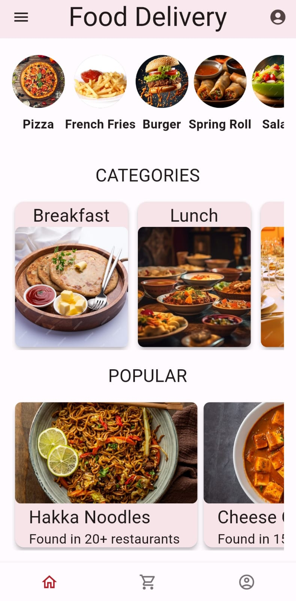
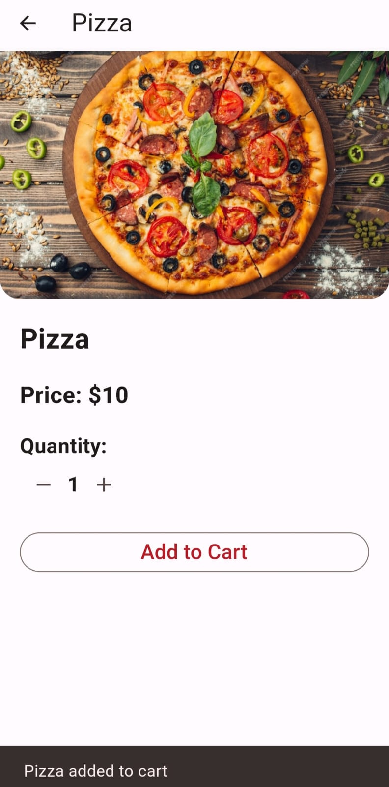
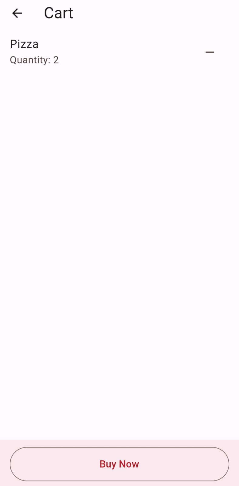
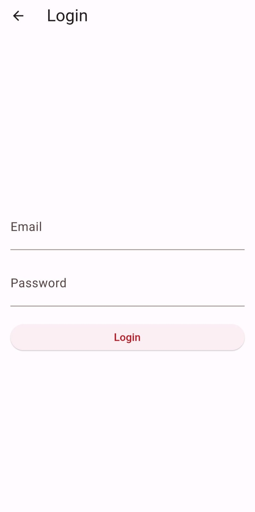

# Food Delivery App

A mobile application built using Flutter for ordering food items and managing a cart.

## Features

- View various food items.
- Add items to the cart.
- View the cart contents and remove items.
- Purchase items directly from the cart.

## Screenshots

### Home Page



### Product Page


### Cart Page


### Login Page


### Account Page


## Installation

1. **Clone the repository:**

    ```bash
    git clone https://github.com/its-me-abhishek/food-delivery-app.git
    ```

2. **Run the application:**

    Navigate into the project directory and execute:

    ```bash
    flutter run
    ```

## Technologies Used

- Flutter
- Dart
- Firebase

## Future Enhancements

- Working on UI and various pages for the application
- Dark mode theme implementation

